## Mission

Data for Canada exists to bridge the gap between open data availability, resiliency, and usability. We curate, clean, and re-engineer high-value Canadian datasets into high-performance, analysis-ready formats for data engineers, researchers/scientists, developers, and systems.

## The Problem

Canada creates incredible amounts of open data, from foundational road networks to federal census statistics and orthoimagery. However, these datasets are often locked in legacy formats, fragmented portals, or structures that require significant engineering effort to normalize. For our target audience, the "time-to-insight" is often bottlenecked by data preparation.

**Data Stability:**
Beyond technical barriers, open data can be ephemeral. Links break, portals are reorganized, and priorities shift, causing valuable datasets to vanish from the public web. This instability makes it risky to build long-term research or software on top of data providers.

## What Guides Us

We prioritize our work in a utilitarian manner, aiming to provide the greatest amount of good to the greatest amount of individuals. Our approach is guided by the principles of **digital preservation** and the need to keep public information accessible over the long term.

Our approach is guided by the following:

* [Link rot in LIS literature: a 20-year study of web citation decay, recovery and preservation challenges](https://doi.org/10.1108/AJIM-05-2025-0286)
* [Guidance on Assessing Readiness to Manage Data According to the Findable, Accessible, Interoperable and Reusable (FAIR) Principles](https://www.canada.ca/en/government/system/digital-government/digital-government-innovations/information-management/guidance-assessing-readiness-manage-data-according-findable-accessible-interoperable-reusable-principles.html)
* [GC White Paper: Data Sovereignty and Public Cloud](https://www.canada.ca/en/government/system/digital-government/digital-government-innovations/cloud-services/digital-sovereignty/gc-white-paper-data-sovereignty-public-cloud.html)
* [Sustainability of Digital Formats: Planning for Library of Congress Collections](https://www.loc.gov/preservation/digital/formats/index.html)
* [Cloud-Optimized Geospatial Formats Guide](https://guide.cloudnativegeo.org/)
* [Science Needs a Social Network for Sharing Big Data](https://hackmd.io/wKKm4cIDR6a9kYwZ3srVFg?view)
## The Solution

We act as the transformation layer. We aggregate datasets with permissive licenses and process them into "digestible" standards optimized for modern downstream applications.

* **For Data Engineers, Researchers/Scientists, and Developers:** Skip the cleaning phase. Access normalized, documented data ready for analysis.
* **For Systems:** Standardized data structures designed to feed directly into pipelines, data warehouses, and downstream services.

**Our Stewardship:**
Data for Canada takes ownership of the datasets we create, from start to finish. We ensure that data remains consistent and available, acting as a stable foundation for your work, and allowing for reliable analysis across **time and space**. By decoupling access from the original source, we ensure your pipelines don't break even if the upstream location changes or expires.

## Target Software Ecosystem

We adopt an **open-source first** approach, while supporting proprietary solutions to the best of our ability to ensure maximum accessibility. **We target the latest versions of these software packages** (e.g., modern GDAL/OGR) to leverage the newest improvements.

Our data is optimized for:

| Category | Recommended Stack & Libraries |
| :--- | :--- |
| **Core & Desktop** | [GDAL/OGR](https://gdal.org/), [QGIS](https://qgis.org/), [QField](https://qfield.org/) |
| **Python & Data** | [GeoPandas](https://geopandas.org/), [Lonboard](https://developmentseed.org/lonboard/latest/), [DuckDB](https://duckdb.org/), [SedonaDB](https://sedona.apache.org/sedonadb/latest/)|
| **Database** | [PostgreSQL](https://www.postgresql.org/) with [PostGIS](https://postgis.net/) and [pg_mooncake](https://www.mooncake.dev/pgmooncake/) extensions |
| **Serving** | [GeoServer](https://geoserver.org/), [Martin](https://martin.maplibre.org/), [ZOO-Project](https://zoo-project.org/) |
| **Serverless** | [Cloudflare Workers](https://workers.cloudflare.com/), [AWS Lambda](https://aws.amazon.com/lambda/), [Google Cloud Run functions](https://cloud.google.com/functions) |
| **Enterprise** | [ArcGIS Pro](https://www.esri.com/en-us/arcgis/products/arcgis-pro/overview), [ArcGIS Enterprise](https://enterprise.arcgis.com/) |

## Explore Sample Datasets

See our processing pipeline in action. View samples and documentation for our current priority processes:

* [**Statistical Products**](https://www.dataforcanada.org/docs/processes/statistical_products/): Census data and other quantitative datasets.
* [**Foundation**](https://www.dataforcanada.org/docs/processes/foundation/#download-and-preview/): Core geospatial layers including address point, road networks, and buildings.
* [**Orthoimagery**](https://www.dataforcanada.org/docs/processes/orthoimagery/#download-and-preview): High-resolution orthoimagery.

## High-Level Overview

**Note:** The data sources in the diagram below are **prioritized from left to right**, reflecting our current focus on processing high-value [statistical](https://www.dataforcanada.org/docs/processes/statistical_products/), [foundational](https://www.dataforcanada.org/docs/processes/foundation/#download-and-preview), and [orthoimagery](https://www.dataforcanada.org/docs/processes/orthoimagery/#download-and-preview) datasets first.

```mermaid
flowchart TD
    classDef linkNode stroke:#0000EE,color:#0000EE,stroke-width:2px;
    
    %% ---------------------------------------------------------
    %% 1. DATA SOURCES
    %% ---------------------------------------------------------
    subgraph ds [Data Sources]
        Statistical@{ shape: lean-l}
        Foundation@{ shape: lean-l}
        Orthoimagery@{ shape: lean-l}
        EnvironmentClimate@{ shape: lean-l, label: "Environment, Climate, & Health"}
        FieldImagery@{ shape: lean-l, label: "Field Imagery"}
        Elevation@{ shape: lean-l}
        WebCorpus@{ shape: lean-l, label: "Web Corpus"}
    end

    %% ---------------------------------------------------------
    %% 3. PROCESSING PIPELINE
    %% ---------------------------------------------------------
    subgraph pp [Processing Pipeline]
        %% Not the orchestrator, but a key towards achieving project mission.
        DataforCanadaPackagesCollection@{ shape: rect, label: "Data for Canada Packages Collection"}
        %% Internal Link
    end

    %% ---------------------------------------------------------
    %% 4. DISSEMINATION FORMATS
    %% ---------------------------------------------------------
    subgraph df [Dissemination Formats]
        
        %% Box: Long-Term Storage (Pastel Gold)
        subgraph sot [Long-Term Storage]
            Parquet@{ shape: lean-l}
            Zarr@{ shape: lean-l}
            GeoTIFF@{ shape: lean-l}
            AV1@{ shape: lean-l, label: "Next-Gen Video"}
            JPEGXL@{ shape: lean-l, label: "Next-Gen Imagery"}
            WARC@{ shape: lean-l, label: "Unstructured Web Data"}
            FAIRDataDis@{ shape: lean-l, label: "FAIR Data Catalogue"}
        end

        %% Intermediate format (Standalone)
        FlatGeoBuf@{ shape: lean-l}

        %% Box: Vector Tiles (Pastel Orange)
        subgraph vt [Vector Tiles]
            VectorTiles@{ shape: lean-l, label: "Mapbox Vector Tiles"}
            NextGenVectorTiles@{ shape: lean-l, label: "Next-Gen Vector Tiles"}
        end

        %% Box: Visuals (Pastel Blue - No Name)
        subgraph visuals [" "]
            WebP@{ shape: lean-l}
            JPG@{ shape: lean-l}
            PNG@{ shape: lean-l}
        end

        %% Box: Portable Databases (Pastel Green)
        subgraph pkg [Portable Databases]
            PMTiles@{ shape: lean-l}
            SQLite@{ shape: lean-l}
        end

        %% Box: Enterprise (Pastel Purple)
        subgraph ent [Enterprise]
            FileGeodatabase@{shape: lean-l, label: "File Geodatabase"}
        end
    end

    %% ---------------------------------------------------------
    %% 5. DISTRIBUTION INFRASTRUCTURE
    %% ---------------------------------------------------------
    subgraph di [Distribution Infrastructure]
        ObjectStorage@{ shape: bow-rect, label: "Object Storage"}
        Metadata@{ shape: rect, label: "FAIR Data Catalogue"}
        HTTP@{ shape: rect, label: "Systems-Ready Data"}
        DecentralizedDistribution@{ shape: rect, label: "Decentralized Distribution"}
    end

    %% ---------------------------------------------------------
    %% 6. EXPERIMENTAL INFRASTRUCTURE
    %% ---------------------------------------------------------
    subgraph ei [Experimental Infrastructure]
        GeoSpatialServices@{ shape: rect, label: "Geospatial Services"}
    end

    %% ---------------------------------------------------------
    %% 7. CONSUMPTION
    %% ---------------------------------------------------------
    subgraph "Consumption"
        DataSci@{ shape: rect, label: "Data People & Developers"}
        Systems@{ shape: rect, label: "Systems"}
    end

    %% =========================================================
    %% RELATIONSHIPS
    %% =========================================================

    %% Data Sources <--> Data for Canada Packages Collection (Box)
    Statistical a1@<--> pp
    a1@{animate: true, animation: slow}
    Foundation a2@<--> pp
    a2@{animate: true, animation: slow}
    Orthoimagery a3@<--> pp
    a3@{animate: true, animation: slow}
    EnvironmentClimate a5@<--> pp
    a5@{animate: true, animation: fast}
    FieldImagery a4@<--> pp
    a4@{animate:true, animation: fast}
    Elevation a6@<--> pp
    a6@{animate: true, animation: slow}
    WebCorpus a7@<--> pp
    a7@{animate: true, animation: fast}

    pp a10@--> df
    a10@{animate: true, animation: fast}

    %% Long-Term Storage --> FlatGeoBuf
    sot a10000@<--> FlatGeoBuf
    a10000@{animate: true, animation: fast}
    
    %% FlatGeoBuf --> Vector Tiles (Box)
    FlatGeoBuf a11@--> vt
    a11@{animate: true, animation: fast}

    %% Long-Term Storage <--> Visuals (Box)
    sot a12@<--> visuals
    a12@{animate: true, animation: slow}

    %% Vector Tiles --> Portable Databases (Box)
    vt a90@<--> pkg
    a90@{animate: true, animation: fast}

    %% Visuals --> Portable Databases (Box)
    visuals a93@<--> pkg
    a93@{animate: true, animation: slow}

    %% Long-Term Storage --> Enterprise (Box)
    sot a100@<--> ent
    a100@{animate: true, animation: slow}

    %% Visuals --> Enterprise (Box)
    visuals a102@--> ent
    a102@{animate: true, animation: slow}

    %% Dissemination Formats --> Distribution Infrastructure
    df a13@<--> di
    a13@{animate: true, animation: slow}

    %% Distribution Infrastructure Flow
    ObjectStorage a15@<--> Metadata
    a15@{animate: true, animation: slow}
    Metadata a16@<--> HTTP
    a16@{animate: true, animation: slow}
    
    HTTP a17@<--> ei
    a17@{animate: true, animation: slow}
    HTTP a18@<--> DecentralizedDistribution
    a18@{animate: true, animation: slow}
    HTTP a19@<--> DataSci
    a19@{animate: true, animation: slow}
    
    DecentralizedDistribution a20@--> Systems
    a20@{animate: true, animation: fast}
    DecentralizedDistribution a21@--> DataSci
    a21@{animate: true, animation: fast}
    
    Systems a22@ <--> DataSci
    a22@{animate: true, animation: fast}
    ei a23@ <--> DataSci
    a23@{animate: true, animation: slow}

    %% =========================================================
    %% STYLING
    %% =========================================================

classDef linkNode stroke:#333333,color:#333333,stroke-width:1.5px;

%%style pp fill:#D32F2F,stroke:#8E0000,color:#FFFFFF
style DataforCanadaPackagesCollection fill:#B71C1C,stroke:#7F0000,color:#FFFFFF
style FAIRDataDis fill:#B71C1C,stroke:#7F0000,color:#FFFFFF
style DecentralizedDistribution fill:#B71C1C,stroke:#7F0000,color:#FFFFFF
style HTTP fill:#B71C1C,stroke:#7F0000,color:#FFFFFF
style Systems fill:#B71C1C,stroke:#7F0000,color:#FFFFFF
style Metadata fill:#B71C1C,stroke:#7F0000,color:#FFFFFF

%%style df fill:#D32F2F,stroke:#8E0000,color:#FFFFFF
style sot fill:#EF9A9A,stroke:#C62828,color:#000000

style Parquet fill:#FFCDD2,stroke:#E57373,color:#000000
style Zarr fill:#FFCDD2,stroke:#E57373,color:#000000
style GeoTIFF fill:#FFCDD2,stroke:#E57373,color:#000000
style JPEGXL fill:#FFCDD2,stroke:#E57373,color:#000000
style WARC fill:#FFCDD2,stroke:#E57373,color:#000000
style AV1 fill:#FFCDD2,stroke:#E57373,color:#000000

style ds fill:#FB8C00,stroke:#E65100,color:#000000

style pkg fill:#FFB74D,stroke:#EF6C00,color:#000000
style SQLite fill:#EF6C00,stroke:#E65100,color:#000000
style PMTiles fill:#FFCC80,stroke:#FB8C00,color:#000000

style vt fill:#FBC02D,stroke:#F9A825,color:#000000
style FlatGeoBuf fill:#FBC02D,stroke:#F9A825,color:#000000

style visuals fill:#FBC02D,stroke:#F9A825,color:#000000

style ent fill:#66BB6A,stroke:#2E7D32,color:#000000
style DataSci fill:#D32F2F,stroke:#8E0000,color:#FFFFFF
style GeoSpatialServices fill:#FFCC80,stroke:#FB8C00,color:#000000


class Foundation,Statistical,Orthoimagery,FieldImagery,EnvironmentClimate,Elevation,WebCorpus linkNode
class Parquet,FlatGeoBuf,SQLite,FileGeodatabase,VectorTiles,NextGenVectorTiles,GeoTIFF,Zarr,WebP,PMTiles,JPEGXL,AV1,WARC linkNode

    %% =========================================================
    %% CLICK ACTIONS
    %% =========================================================
    click DataforCanadaPackagesCollection "https://github.com/dataforcanada/dataforcanadapkgs-labs/" _blank

    click Foundation "https://github.com/dataforcanada/process-foundation-labs/" _blank
    click Statistical "https://github.com/dataforcanada/process-statistical-labs/" _blank
    click Orthoimagery "https://github.com/dataforcanada/process-orthoimagery-labs/" _blank
    click FieldImagery "https://github.com/dataforcanada/process-field-imagery-labs/" _blank
    click EnvironmentClimate "https://github.com/dataforcanada/process-environmental-climate-health-labs/" _blank
    click Elevation "https://github.com/dataforcanada/process-elevation-labs/" _blank
    click WebCorpus "https://github.com/dataforcanada/process-web-corpus-labs/" _blank

    click Parquet "https://github.com/apache/parquet-format/" _blank
    click FlatGeoBuf "https://flatgeobuf.org/" _blank
    click SQLite "https://www.geopackage.org/" _blank
    click FileGeodatabase "https://gdal.org/en/stable/drivers/vector/openfilegdb.html" _blank
    click VectorTiles "https://github.com/mapbox/vector-tile-spec/" _blank
    click NextGenVectorTiles "https://github.com/maplibre/maplibre-tile-spec/" _blank
    click GeoTIFF "https://cogeo.org/" _blank
    click Zarr "https://github.com/zarr-developers/geozarr-spec/" _blank
    click WebP "https://developers.google.com/speed/webp/" _blank
    click PMTiles "https://github.com/protomaps/PMTiles/blob/main/spec/v3/spec.md" _blank
    click JPEGXL "https://jpeg.org/jpegxl/" _blank
    click AV1 "https://aomedia.org/specifications/av1/" _blank
    click WARC "https://github.com/iipc/warc-specifications/" _blank
    click FAIRDataDis "https://stac-utils.github.io/stac-geoparquet/latest/spec/stac-geoparquet-spec/" _blank

    click HTTP "https://www.dataforcanada.org/docs/" _blank
    click DecentralizedDistribution "https://www.dataforcanada.org/docs/dissemination/" _blank
    click Metadata "https://stac-utils.github.io/stac-geoparquet/latest/spec/stac-geoparquet-spec/" _blank
    click GeoSpatialServices "https://github.com/dataforcanada/geo-services-labs/" _blank
```

## Get Involved

We are actively looking for new members and partners to help shape this project.

### 🇨🇦 Infrastructure Support: Selective Mirroring

To support data sovereignty, safeguard against data loss, and improve local access speeds, **we are currently seeking selective mirroring in Canada**. See our [Infrastructure](/infrastructure).

We are looking for academic institutions, research organizations, or **infrastructure partners** interested in hosting mirrors of specific, high-value dataset subsets. If you have bandwidth and storage capacity to spare for the Canadian open data ecosystem, please [contact us](https://www.dataforcanada.org/contact/).

### Contributing & Feedback

Right now, we primarily need **feedback on file naming convention, our datasets and their underlying processes, and the infrastructure** used to generate them. If you have thoughts on data quality, format optimization, or pipeline improvements, we want to hear from you.

* **Discussions:** Head over to [#dataforcanada:matrix.org](https://matrix.to/#/#dataforcanada:matrix.org) to chat, or go to the individual process GitHub repos to comment on specific issues.

## License

This project is licensed under the [MIT License](https://opensource.org/license/mit).
