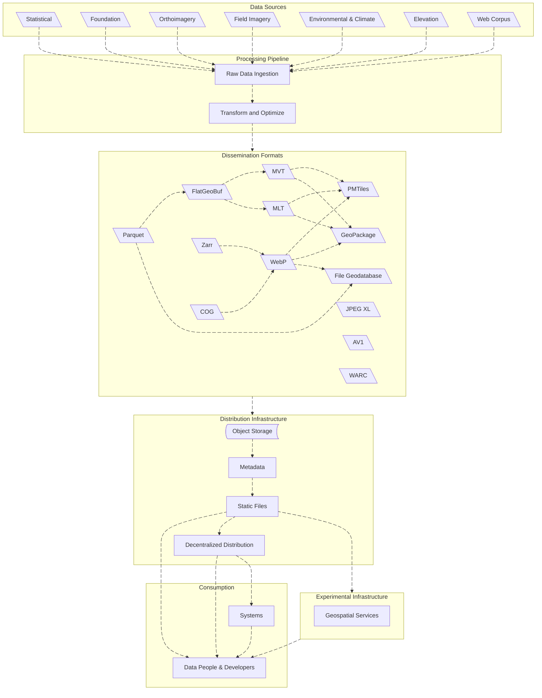

## Mission

Data for Canada exists to bridge the gap between open data availability and data usability. We curate, clean, and re-engineer high-value Canadian datasets into high-performance, analysis-ready formats for data engineers, researchers/scientists, developers, and systems.

## The Problem

Canada creates incredible amounts of open data, from foundational road networks to federal census statistics and orthoimagery. However, these datasets are often locked in legacy formats, fragmented portals, or structures that require significant engineering effort to normalize. For our target audience, the "time-to-insight" is often bottlenecked by data preparation.

## The Solution

We act as the transformation layer. We aggregate datasets with permissive licenses and process them into "digestible" standards optimized for modern downstream applications.

* **For Data Engineers, Researchers/Scientists, and Developers:** Skip the cleaning phase. Access normalized, documented data ready for analysis.
* **For Systems:** Standardized data structures designed to feed directly into pipelines, data warehouses, and downstream services.

**Our Stewardship:**
Data for Canada takes ownership of the datasets we create, from start to finish. We ensure that data remains consistent, allowing for reliable analysis across **time and space**.

## Explore Sample Datasets

See our processing pipeline in action. View samples and documentation for our current priority processes:

* [**Statistical Products**](https://www.dataforcanada.org/docs/processes/statistical_products/): Census data and other quantitative datasets.
* [**Foundation**](https://www.dataforcanada.org/docs/processes/foundation/#download-and-preview/): Core geospatial layers including address point, road networks, and buildings.
* [**Orthoimagery**](https://www.dataforcanada.org/docs/processes/orthoimagery/#download-and-preview): High-resolution orthoimagery.

## What Guides Us

We prioritize our work in a utilitarian manner, aiming to provide the greatest amount of good to the greatest amount of individuals, though we remain open to making exceptions where necessary.

Our approach is guided by the following:

* [Link rot in LIS literature: a 20-year study of web citation decay, recovery and preservation challenges](https://doi.org/10.1108/AJIM-05-2025-0286)
* [Sustainability of Digital Formats: Planning for Library of Congress Collections](https://www.loc.gov/preservation/digital/formats/index.html)
* [Guidance on assessing readiness to manage data according to Findable, Accessible, Interoperable, Reusable (FAIR) principles](https://www.canada.ca/en/government/system/digital-government/digital-government-innovations/information-management/guidance-assessing-readiness-manage-data-according-findable-accessible-interoperable-reusable-principles.html)
* [GC White Paper: Data Sovereignty and Public Cloud](https://www.canada.ca/en/government/system/digital-government/digital-government-innovations/cloud-services/digital-sovereignty/gc-white-paper-data-sovereignty-public-cloud.html)

## High-Level Overview

**Note:** The data sources in the diagram below are **prioritized from left to right**, reflecting our current focus on processing high-value [statistical](https://www.dataforcanada.org/docs/processes/statistical_products/), [foundational](https://www.dataforcanada.org/docs/processes/foundation/#download-and-preview), and [orthoimagery](https://www.dataforcanada.org/docs/processes/orthoimagery/#download-and-preview) datasets first.

## Target Software Ecosystem

We adopt an **open-source first** approach, while supporting proprietary solutions to the best of our ability to ensure maximum accessibility. **We target the latest versions of these software packages** (e.g., modern GDAL/OGR) to leverage the newest improvements.

Our data is optimized for:

* **Core Libraries & Tools:** [GDAL/OGR](https://gdal.org/), [QGIS](https://qgis.org/), and [QField](https://qfield.org/).
* **Analysis & Database:** [DuckDB](https://duckdb.org/), [SedonaDB](https://sedona.apache.org/sedonadb/latest/).
* **Serving:** [GeoServer](https://geoserver.org/), [Martin](https://martin.maplibre.org/), and [ZOO-Project](https://zoo-project.org/).
* **Serverless:** [Cloudflare Workers](https://workers.cloudflare.com/), [AWS Lambda](https://aws.amazon.com/lambda/), and [Google Cloud Run functions](https://cloud.google.com/functions).
* **Enterprise:** Esri based products ([ArcGIS Pro](https://www.esri.com/en-us/arcgis/products/arcgis-pro/overview), [ArcGIS Server](https://enterprise.arcgis.com/)).

## Get Involved

We are actively looking for new members and partners to help shape this project.

### 🇨🇦 Infrastructure Support: Selective Mirroring

To support data sovereignty and improve local access speeds, **we are currently seeking selective mirroring in Canada**.

We are looking for academic institutions, research organizations, or ISPs interested in hosting mirrors of specific, high-value dataset subsets. If you have bandwidth and storage capacity to spare for the Canadian open data ecosystem, please [contact us](https://www.dataforcanada.org/contact/).

### Contributing & Feedback

Right now, we primarily need **feedback on our datasets and the underlying processes** used to generate them. If you have thoughts on data quality, format optimization, or pipeline improvements, we want to hear from you.

* **Discussions:** Head over to [#dataforcanada:matrix.org](https://matrix.to/#/#dataforcanada:matrix.org) to chat, or go to the individual process GitHub repos to comment on specific issues.

## License

This project is licensed under the [MIT License](https://opensource.org/license/mit).