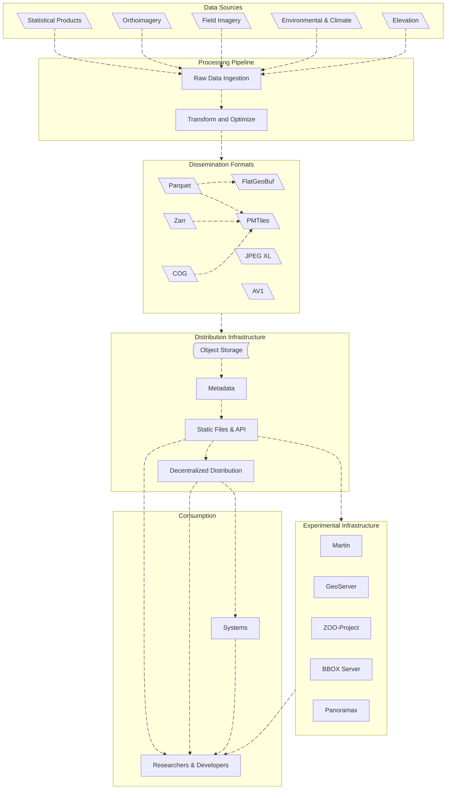

## Mission

Data for Canada exists to bridge the gap between open data availability and data usability. We curate, clean, and re-engineer high-value Canadian datasets into high-performance, analysis-ready formats for researchers, developers, and systems.

## The Problem

Canada creates incredible amounts of open data, from foundational road networks, federal census statistics, orthoimagery, and other. However, these datasets are often locked in legacy formats, fragmented portals, or structures that require significant engineering effort to normalize before they can be used. For a researcher or a system developer, the "time-to-insight" is often bottlenecked by data preparation.

## The Solution

We act as the transformation layer. We aggregate datasets with permissive licenses and process them into "digestible" standards optimized for modern downstream applications.

* **For Researchers and Developers:** Skip the cleaning phase. Access normalized, documented data ready for analysis.
* **For Systems:** Standardized data structures designed to feed directly into pipelines, data warehouses, and downstream services.

## High-Level Overview

