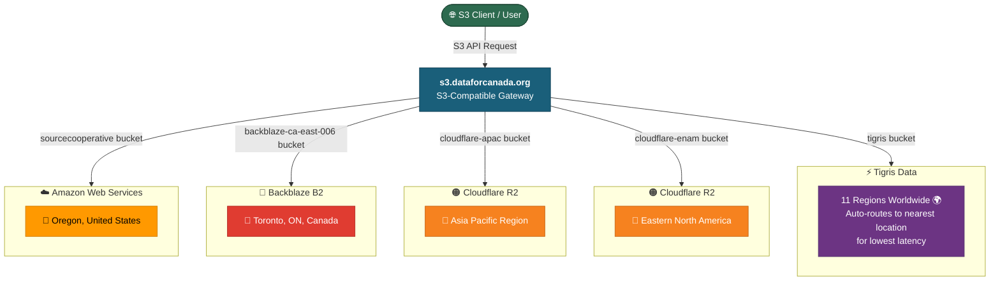

A core part of the mission here at Data for Canada is modernizing how we access, store, and interact with public datasets. Today, we are excited to announce a step forward in our infrastructure with the deployment of a new S3-compatible API and a companion web-based explorer.

These two tools are designed to serve both programmatic workflows and everyday discovery.

## 1. The Programmatic S3 Interface
[developmentseed/multistore](https://github.com/developmentseed/multistore/) has been successfully deployed to [https://s3.dataforcanada.org/](https://s3.dataforcanada.org/).

For data pipelines and cloud-native workflows, standard access protocols are everything. Multistore provides a robust S3-compatible interface, allowing developers, researchers, and data engineers to interact with our hosted datasets using familiar S3 tools and libraries. Whether you are automating data pipelines, querying cloud-optimized formats directly over the network, or syncing large datasets, this endpoint ensures that data retrieval is fast, scalable, and standardized.

## 2. The S3 Browser UI
To complement the API, we have also deployed [walkthru-earth/objex](https://github.com/walkthru-earth/objex) to [https://objex.labs.dataforcanada.org/](https://objex.labs.dataforcanada.org/).

While an S3 API is perfect for code, sometimes you just need to look around. Objex provides a lightweight, clean, and intuitive web interface for browsing our storage buckets. This allows anyone to navigate through directory structures, discover what files are available, and download data directly from their browser—no command-line tools or specialized software required. 

### Supported Formats
As of May 3, 2026, objex supports over 100 file formats.

| Category | Formats |
|----------|---------|
| Tabular | Parquet, CSV, TSV, JSONL, NDJSON |
| Geo vector | GeoParquet, GeoJSON, Shapefile, GeoPackage, FlatGeobuf |
| Geo raster | COG, PMTiles, Zarr v2/v3, GeoZarr |
| Geo catalog | STAC Item / Collection / Catalog / FeatureCollection (JSON), stac-geoparquet |
| Point cloud | COPC, LAZ, LAS |
| Notebooks | Jupyter (.ipynb), marimo |
| Code | 30+ languages (Python, TS, Rust, Go, SQL...) |
| Documents | Markdown, PDF, text, logs |
| Media | Images, video, audio |
| 3D | GLB, glTF, OBJ, STL, FBX |
| Archives | ZIP, TAR, GZ, 7Z, RAR |
| Database | DuckDB, SQLite |

## What’s Next?
By pairing a standardized S3 API with a human-readable explorer, we are bridging the gap between heavy-duty engineering requirements and general public accessibility.

Take a look around the new explorer, test out the S3 endpoint in your workflows, and stay tuned for more updates as we continue to build out the Data for Canada infrastructure!