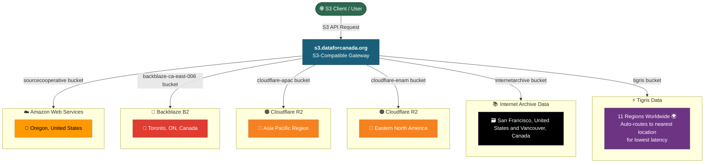
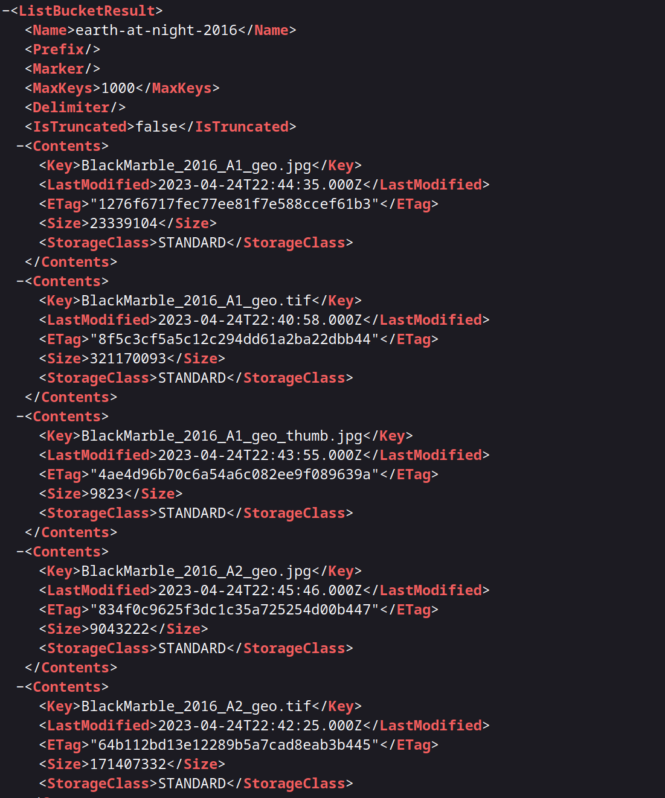

We have added the `internetarchive` bucket to [https://s3.labs.dataforcanada.org](https://s3.labs.dataforcanada.org), which proxies directly to the Internet Archive. This opens up a massive amount of data to standard S3 API calls, but there are a few important caveats regarding performance and discovery.

## The Quest for Efficiency

Integrating the Internet Archive wasn't without its hurdles. I started by using the official Internet Archive endpoint defined in their [ias3 documentation](https://archive.org/developers/ias3.html) (https://s3.us.archive.org). Unfortunately, even when using authenticated API keys, requests were throttled almost immediately.

To make this architecture **as efficient as possible**, I had to pivot. Instead of relying on the standard S3 endpoint, I switched the backend to utilize the Internet Archive's native HTTP paths, wrapping them in a custom S3 interface:

* `http://archive.org/download/{identifier}` for optimized file downloading.
* `https://archive.org/metadata/{identifier}` for fetching JSON metadata.

Even with this highly optimized, custom approach, you will still encounter rate throttling. We have added a bandwidth quota of **30GB per 5 minutes**.

## How to Access the Data

Because of how this proxy functions, you currently need to know the exact identifier (which acts as your bucket) of the dataset you want to access.

Let's use the `earth-at-night-2016` dataset as an example. Behind the scenes, the native archive links look like this:

* **Download:** https://archive.org/download/earth-at-night-2016
* **Metadata:** https://archive.org/metadata/earth-at-night-2016

Through our gateway, you can access this identical dataset using standard S3 protocols simply by pointing your client here:

* **S3 Gateway:** https://s3.labs.dataforcanada.org/internetarchive/earth-at-night-2016

## What's Next?

Right now, finding these dataset identifiers requires manually browsing the Internet Archive. Because this proxy implementation is now as fast and efficient as the upstream rate limits will allow, my next goal is to improve discovery.

In the future, I plan to build a simple, searchable file and metadata index of the Internet Archive directly into the platform. I'm a big fan of movies, so I'll be starting the indexing process there!