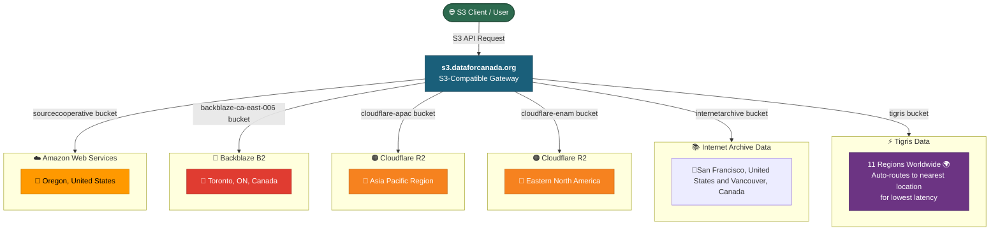
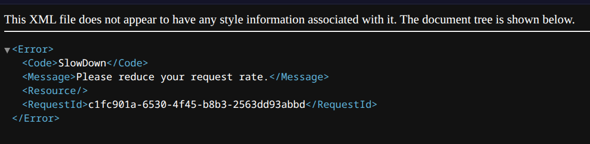

We have added the internetarchive bucket to https://s3.labs.dataforcanada.org.

# Notes
- Internet Archive  S3 Documentation https://archive.org/developers/ias3.html
- You need to know your identifier of your dataset (aka your bucket). For example, [earth-at-night-2016](https://s3.labs.dataforcanada.org/internetarchive/earth-at-night-2016)
- 30 GB per 5 minute bandwidth quota as the Internet Archive has limited budget
- Curious if anybody has made an index of all Internet Archive buckets
- I believe it would be ideal to have an Internet Archive serverless worker(s) that are situated closer to the Internet Archive, then connect to those, as they do not have a CDN 

- And it looks like we're getting throttled, even with keys

- Due to IA's architecture, it might be necessary to map their /download, for example http://archive.org/download/region-of-peel-2021-orthoimagery/Peel_75mm_2021.tif to S3 operations
