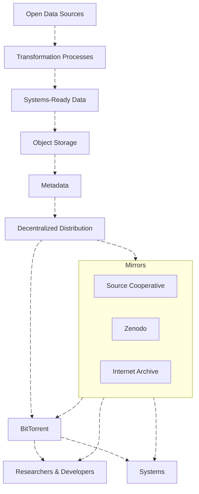

Our dissemination strategy prioritizes interoperability, long-term preservation, and decentralized resilience.

## High-Level Overview

## Dissemination Process
Once data products reach a production-ready state, the workflow is as follows:

- **Cloud-Native First:** Priority is given to highly performant, system-to-system file formats (e.g., Parquet) to enable highly performant applications.
- **Persistent Identification & Cataloging:** Every dataset version will be assigned a DOI for citation and immutability.
  - The endpoint `https://data-01.dataforcanada.org/processed/` will strictly serve the **latest** version of a dataset.
  - Global metadata will be aggregated into a single, queryable [STAC GeoParquet](https://stac-utils.github.io/stac-geoparquet/latest/spec/stac-geoparquet-spec/) file. This catalog will track all versions and DOIs, directing users to our multi-tier storage network:
    - **[Source Cooperative](https://source.coop/dataforcanada)** serves as our **primary mirror** for all datasets, including large-scale products like orthoimagery (see [Funding and Governance](https://docs.source.coop/#funding-and-governance)).
    - **[Zenodo](https://zenodo.org/communities/dataforcanada/)** serves as our repository for **long-term preservation** and provides a mirror for users in Europe (see [Funding](https://about.zenodo.org/infrastructure/)).
    - **[The Internet Archive](https://archive.org)** is utilized **strategically** for specific datasets to minimize load on their limited infrastructure (see [Funding](https://projects.propublica.org/nonprofits/organizations/943242767)).
- **Decentralized Distribution:** We will pilot BitTorrent to maximize infrastructure resilience. By leveraging [HTTP Web Seeding (BEP 19)](https://www.bittorrent.org/beps/bep_0019.html), torrents will be seeded simultaneously by Source Cooperative, Zenodo, the Data for Canada infrastructure, and community peers, ensuring high availability without a single point of failure. Current laboratory work is available on the [dataforcanada/decentralized-distribution-labs](https://github.com/dataforcanada/decentralized-distribution-labs) repo.

## Work in the Lab: Smartnodes

To further democratize access and ensure the persistence of Canada’s open data, we are experimenting with the features defined in previous **smartnode** work done by [Academic Torrents](https://academictorrents.com/docs/mirroring.html#smartnodes).

A smartnode functions as a "set-it-and-forget-it" volunteer server, an automated library branch for our data infrastructure.

* **Automated Mirroring:** Unlike a standard download, a smartnode automatically synchronizes with our central catalog. It intelligently fetches new or "at-risk" datasets to ensure they remain available even if the central portal experiences downtime.
* **Volunteer-Powered Resilience:** This model allows partner institutions (universities, research labs) and public volunteers to donate bandwidth and storage. By running a smartnode, contributors actively protect vital Canadian datasets from being lost or gated behind paywalls.
* **Dynamic Storage Management:** The node software monitors network health, automatically prioritizing rare data to maintain high availability across the entire Data for Canada ecosystem.

We are currently refining the concepts from  [smart-node-transmission](https://github.com/academictorrents/smartnode-transmission)  to work seamlessly with our STAC GeoParquet catalog, enabling a fully decentralized data mesh for Canadian geospatial information.
