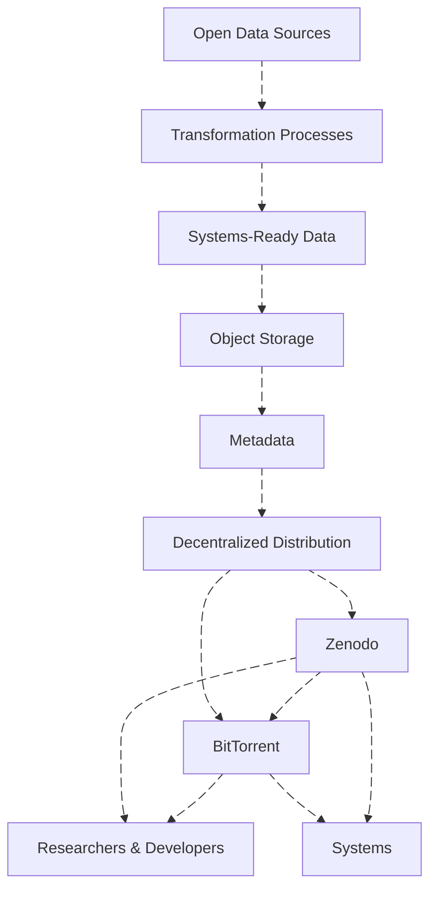

Our dissemination strategy prioritizes interoperability, long-term preservation, and decentralized resilience.

Once data products reach a production-ready state, the workflow is as follows:

* **Cloud-Native First:** Priority is given to highly performant, system-to-system file formats (e.g., Parquet) to enable highly performant applications.
* **Persistent Identification & Cataloging:** Every dataset version will be assigned a DOI for citation and immutability.
  * The endpoint `https://data-01.dataforcanada.org/processed/` will strictly serve the **latest** version of a dataset.
  * Global metadata will be aggregated into a single, queryable [STAC GeoParquet](https://stac-utils.github.io/stac-geoparquet/latest/spec/stac-geoparquet-spec/) file. This catalog will track all versions and DOIs, providing direct download links to [Zenodo](https://zenodo.org/communities/dataforcanada/) which serves as the long-term data repository.
* **Decentralized Distribution:** We will pilot BitTorrent to maximize infrastructure resilience. By leveraging [HTTP Web Seeding (BEP 19)](https://www.bittorrent.org/beps/bep_0019.html), torrents will be seeded simultaneously by Zenodo, the Data for Canada infrastructure, and community peers, ensuring high availability without a single point of failure.

## High-Level Overview

