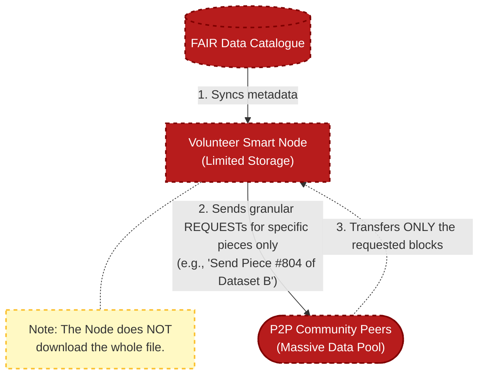


We prioritize interoperability, long-term preservation, and decentralized resilience.


## High-Level Overview

```mermaid
flowchart TD
    classDef linkNode stroke:#0000EE,color:#0000EE,stroke-width:2px;
    subgraph mirrors [Mirrors & Preservation]
        SourceCoop[Source Cooperative]
        Zenodo[Zenodo]
        InternetArchive[Internet Archive]
        Community[Community]
    end

    Sources[Open Data Sources]
    Processes[Data for Canada Packages Collection]
    Artifacts[Systems-Ready Data]
    
    subgraph CoreInfra [Infrastructure]
        Portal[Object Storage]
        Metadata[FAIR Data Catalogue]
    end
    
    P2P["P2P Technology"]
    
    subgraph Consumers [Consumption]
        Users[Data People & Developers]
        Systems[Systems]
    end

    %% Flow with Animations
    Sources a1@<--> Processes
    a1@{animate: true, animation: slow}
    
    Processes a2@<--> Artifacts
    a2@{animate: true, animation: slow}
    
    Artifacts a3@<--> CoreInfra
    a3@{animate: true, animation: slow}
    
    Portal a4@<--> Metadata
    a4@{animate: true, animation: fast}
    
    Metadata a5@<--> mirrors
    a5@{animate: true, animation: fast}

    CoreInfra a8@<-.->P2P
    a8@{animate: true, animation: slow}

    %% Mirror Connections
    mirrors a12@<--> Consumers
    a12@{animate: true, animation: slow}
    
    mirrors a9@<-.->|Pooled| P2P
    a9@{animate: true, animation: fast}

    %% P2P Connections
    P2P a10@<--> Consumers
    a10@{animate: true, animation: fast}
    
    style Sources fill:#FFB74D,stroke:#EF6C00,color:#000000
    style Artifacts fill:#B71C1C,stroke:#7F0000,color:#FFFFFF
    %% Opera concertmaster
    style Metadata fill:#B71C1C,stroke:#7F0000,color:#FFFFFF
    class Metadata Metadata
    style Processes fill:#B71C1C,stroke:#7F0000,color:#FFFFFF
    class Processes Processes
    style SourceCoop fill:#B71C1C,stroke:#7F0000,color:#FFFFFF
    style Zenodo fill:#FFB74D,stroke:#EF6C00,color:#000000
    style Community fill:#D32F2F,stroke:#8E0000,color:#FFFFFF
    style P2P fill:#B71C1C,stroke:#7F0000,color:#FFFFFF
    style InternetArchive fill:#66BB6A,stroke:#2E7D32,color:#000000
    style Users fill:#FFB74D,stroke:#EF6C00,color:#000000
    style Systems fill:#B71C1C,stroke:#7F0000,color:#FFFFFF
    
    %% Click Actions
    click Sources "https://www.dataforcanada.org/#high-level-overview" _blank
    click Processes "https://www.dataforcanada.org/docs/processes/" _blank
    click Artifacts "https://www.dataforcanada.org/docs/getting_started/" _blank
    click Metadata "https://stac-utils.github.io/stac-geoparquet/latest/spec/stac-geoparquet-spec/" _blank
    click Zenodo "https://zenodo.org/communities/dataforcanada/" _blank
    click SourceCoop "https://source.coop/dataforcanada/" _blank
    click InternetArchive "https://archive.org/details/@diegoripley/uploads/" _blank

    %% APPLY STYLES TO LINKED NODES
    class Sources linkNode
```

## Dissemination Process

Once data products reach a production-ready state, they enter a dissemination flow designed for permanence and performance:

* **Cloud-Native First:** Priority is given to performant, system-to-system file formats (e.g., Parquet) to enable high-throughput applications without the need for local parsing.
* **Persistent Identification:** Every dataset version is assigned a DOI for citation and immutability.
* **The FAIR Data Catalogue:** Global metadata is aggregated into a single, queryable **[FAIR Data Catalogue](https://stac-utils.github.io/stac-geoparquet/latest/spec/stac-geoparquet-spec/)**. This catalog acts as the "brain" of the system, tracking all versions and DOIs, and directing users to the optimal source within our multi-tier storage network:
  * **[Source Cooperative](https://source.coop/dataforcanada)** serves as our **primary mirror** for all datasets, including large-scale products like orthoimagery (see [Funding and Governance](https://docs.source.coop/#funding-and-governance)).
  * **[Zenodo](https://zenodo.org/communities/dataforcanada/)** serves as our repository for **long-term academic preservation** and provides a high-speed mirror for European users (see [Funding](https://about.zenodo.org/infrastructure/)).
  * **[The Internet Archive](https://archive.org)** is utilized **strategically** for specific datasets to ensure historical redundancy (see [Funding](https://projects.propublica.org/nonprofits/organizations/943242767)).
  * **[Data for Canada Infrastructure](https://www.dataforcanada.org/infrastructure/)** is utilized **strategically** for specific datasets of high-value.

### Decentralized Distribution

We are piloting a <abbr title="Peer-to-Peer">P2P</abbr> technology, to maximize infrastructure resilience. By leveraging the [P2P HTTP  consumption feature](https://www.bittorrent.org/beps/bep_0019.html), users will be able to download simultaneously from Source Cooperative, Zenodo, Data for Canada infrastructure, and community peers. This ensures high availability without a single point of failure. Current laboratory work is available in the [Decentralized Distribution Labs](https://github.com/dataforcanada/decentralized-distribution-labs).

## 🏗️ Open Processing Architecture

We believe that true open data requires open production. To ensure the longevity and resilience of Canada's data infrastructure, we treat our data pipelines as **open source software artifacts**. We provide the "blueprints" alongside the data, allowing any user to verify our work or rebuild the dataset from scratch on their own infrastructure.

### The Blueprint Model

Our processing strategy relies on three immutable components to guarantee transparency:

1. **Build Manifests:** Every dataset version is accompanied by a strict manifest. This locks the exact "ingredients" used: the cryptographic hashes of the raw source files, the specific Git commit of the processing code, and the configuration parameters.
2. **Environment Definitions:** Rather than opaque binaries, we publish the exact **Infrastructure as Code (IaC)** definitions (e.g., Dockerfiles). This allows users to inspect the system context (GDAL versions, libraries, and dependencies) and build the environment themselves.
3. **Deterministic Builds:** By combining a *Build Manifest* with our *Environment Definitions*, any user can execute a **deterministic build**. This process guarantees a bit-for-bit identical copy of the official Data for Canada artifact, ensuring that the pipeline is independent of our specific servers.

**Mirrored Source Artifacts:**
Crucially, we do not rely solely on external version control systems like GitHub, which may change or disappear. A complete snapshot of the processing code, environment definitions, and manifests is bundled with every data release. These source artifacts are replicated across **Source Cooperative, Zenodo, the Internet Archive, Data for Canada infrastructure, and the community**, ensuring that the *method* of creation is preserved with the same redundancy as the *result*.

## Work in the Lab: Smart Nodes

To further democratize access and ensure the persistence of Canada’s open data, we are experimenting with the features defined in previous work done by other organizations.

A Smart Node functions as a "set-it-and-forget-it" volunteer server, an automated library branch for our data infrastructure.

* **Automated Mirroring:** Unlike a standard download, a Smart Node automatically synchronizes with our central **FAIR Data Catalog**. It intelligently fetches new or "at-risk" datasets to ensure they remain available even if the central portal experiences downtime.
* **Volunteer-Powered Resilience:** This model allows partner institutions (ex. universities, research labs) and public volunteers to donate bandwidth and storage. By running a Smart Node, contributors actively protect vital Canadian datasets from being lost or gated.

* **Dynamic Storage Management:** The node software monitors network health to optimize resource usage. Leveraging the  <abbr title="Peer-to-Peer">P2P</abbr> technology's capability for **selective piece mapping**, the node does not need to store the entire catalog. Instead, it identifies specific file indices or "rare" pieces within the metadata and sends granular `REQUEST` messages for only those blocks. This allows a node with limited storage (ex. 500GB) to provide critical redundancy for a much larger archive (ex. 50TB) by surgically targeting only the data that is currently under shared.

We are currently refining the concepts from [smart-node-transmission](https://github.com/academictorrents/smartnode-transmission) to work seamlessly with our catalog, enabling a fully decentralized data mesh for Canadian geospatial information.

