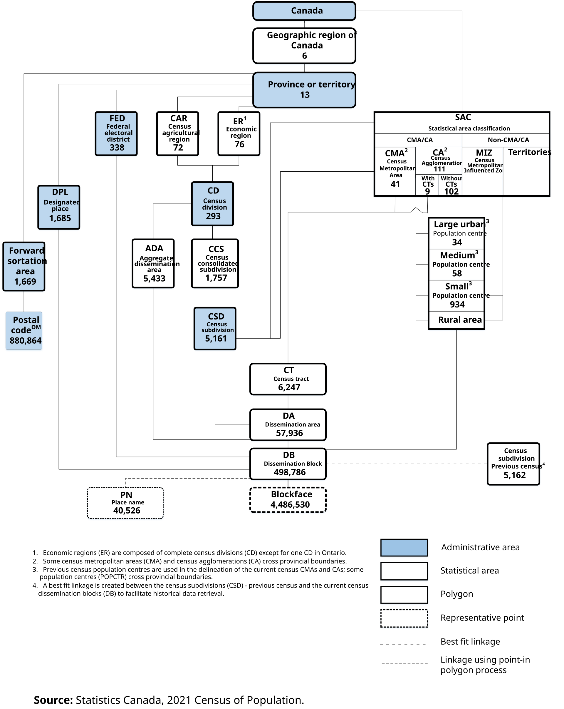

# Terms and Definitions

This document provides a standardized lexicon for the **Data for Canada (D4C)** project, categorized by data package and infrastructure component.

<!--
## 1. Foundation Data Package

Terms related to base-layer datasets and structural identifiers.

* **[DGUID (Dissemination Geography Unique Identifier)](https://www12.statcan.gc.ca/census-recensement/2021/ref/dict/az/Definition-eng.cfm?ID=geo055):** An alphanumeric code used by Statistics Canada to uniquely identify a geographic area. It incorporates the vintage (year), type, and specific area code.
* **[Building Footprint](https://www.dataforcanada.org/docs/d4c-pkgs/d4c-datapkg-foundation/):** The two-dimensional boundary of a building’s ground-level perimeter, primarily sourced from the Open Database of Buildings (ODB).
* **[Cloud-Native Geospatial](https://www.dataforcanada.org/docs/getting_started/):** Data formats (e.g., Parquet, GeoZarr) optimized for cloud storage and efficient partial-file reading over HTTP.
-->

## 1. Statistical Data Package

Standard geographic areas from the 2021 Census of Population hierarchy, as defined by Statistics Canada.


  These concepts are key to working with Statistical and Census data from Statistics Canada.


* **[DGUID (Dissemination Geography Unique Identifier)](https://www12.statcan.gc.ca/census-recensement/2021/ref/dict/az/Definition-eng.cfm?ID=geo055):** An alphanumeric code used by Statistics Canada to uniquely identify a geographic area. It incorporates the vintage (year), type, and specific area code.

### Administrative Areas

<!-- TODO: Add images for each of these concepts, ideally using https://imfing.github.io/hextra/docs/guide/shortcodes/cards/>

<!-- Use pics from the illustrated glossary, but definitions from the 2021 Census of Population-->
<!--https://www150.statcan.gc.ca/n1/pub/92-195-x/92-195-x2021001-eng.htm-->
<!--https://www12.statcan.gc.ca/census-recensement/2021/ref/dict/az/index-eng.cfm-->
<!-- Have not been able to find a definition in the 2021 Census Dictionary for country -->
* **Canada:** The highest level of geography, covering the entire country.
* **[Province or Territory (PR)](https://www150.statcan.gc.ca/n1/pub/92-195-x/2021001/geo/prov/prov-eng.htm):** The primary political-administrative subdivisions of Canada.
* **[Census Division (CD)](https://www150.statcan.gc.ca/n1/pub/92-195-x/2021001/geo/cd-dr/cd-dr-eng.htm):** A group of neighboring municipalities joined together for the purposes of regional planning and managing common services.
* **[Census Subdivision (CSD)](https://www150.statcan.gc.ca/n1/pub/92-195-x/2021001/geo/csd-sdr/csd-sdr-eng.htm):** The general term for municipalities or areas treated as municipal equivalents for statistical purposes.
* **[Federal Electoral District (FED)](https://www150.statcan.gc.ca/n1/pub/92-195-x/2021001/geo/fed-cef/fed-cef-eng.htm):** An area represented by a Member of Parliament in the House of Commons.
<!-- TODO: Geographic regions of Canada (GRC). StatCan does not technically provide boundaries, had to create them myself. Add definition, maybe a link to where people can send their feedback on not having official GRC boundaries-->

### Statistical Areas

* **[Aggregate Dissemination Area (ADA)](https://www150.statcan.gc.ca/n1/pub/92-195-x/2021001/geo/ada/ada-eng.htm):** A dissemination geography created by grouping existing dissemination areas, census subdivisions, or census tracts to achieve a target population.
* **[Census Metropolitan Area (CMA)](https://www150.statcan.gc.ca/n1/pub/92-195-x/2021001/geo/cma-rmr/cma-rmr-eng.htm):** An area consisting of one or more adjacent municipalities situated around a major urban core with a total population of at least 100,000.
* **[Census Agglomeration (CA)](https://www150.statcan.gc.ca/n1/pub/92-195-x/2021001/geo/cma-rmr/cma-rmr-eng.htm):** Similar to a CMA, but with a core population of at least 10,000.
* **[Census Tract (CT)](https://www12.statcan.gc.ca/census-recensement/2021/ref/dict/az/Definition-eng.cfm?ID=geo013):** Small, relatively stable geographic areas within CMAs and CAs that usually have a population between 2,500 and 8,000.
* **[Dissemination Area (DA)](https://www12.statcan.gc.ca/census-recensement/2021/ref/dict/az/Definition-eng.cfm?ID=geo021):** A small, stable geographic unit composed of one or more adjacent dissemination blocks.
* **[Dissemination Block (DB)](https://www12.statcan.gc.ca/census-recensement/2021/ref/dict/az/Definition-eng.cfm?ID=geo022):** An area bounded on all sides by roads and/or boundaries of standard geographic areas; the smallest unit of census geography.
* **[Economic Region (ER)](https://www12.statcan.gc.ca/census-recensement/2021/ref/dict/az/Definition-eng.cfm%3FID%3Dgeo023):** A grouping of complete census divisions created as a standard geographic unit for analysis of regional economic activity.
* **[Population Centre (POPCTR)](https://www12.statcan.gc.ca/census-recensement/2021/ref/dict/az/Definition-eng.cfm?ID=geo049a):** An area with a population of at least 1,000 and a density of 400 or more people per square kilometer.
<!-- Gemini can sometimes be...unsmart>
<!--* **[Rural Area](https://www12.statcan.gc.ca/census-recensement/2021/ref/dict/az/Definition-eng.cfm?ID=geo042):** All territory lying outside population centres.-->

## 3. Orthoimagery & Field Imagery Packages

Terms related to imagery processing and remote sensing.

* **[Orthoimagery](https://www.dataforcanada.org/docs/d4c-pkgs/d4c-datapkg-orthoimagery/):** Aerial or satellite imagery geometrically corrected ("orthorectified") such that the scale is uniform, allowing for accurate measurements of distance.
* **[Photogrammetry](https://www.dataforcanada.org/docs/d4c-pkgs/d4c-datapkg-field-imagery/):** The science of making measurements from photographs, used to generate 3D models and orthomosaics.

<!--
## 4. Infrastructure & Distribution

Terms related to the decentralized delivery of D4C data.

* **[Source Cooperative](https://www.dataforcanada.org/infrastructure/):** A cloud-native data publishing utility where D4C hosts primary repositories.
* **[SpatioTemporal Asset Catalogs (STAC)](https://www.dataforcanada.org/docs/d4c-infra-distribution/):** A specification that provides a common language to describe geospatial datasets so they can more easily be indexed and discovered.
-->
