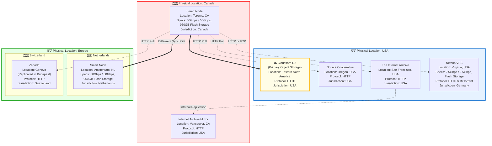

## Roadmap: Resilience & Transparency

To support our mission of providing high-performance, analysis-ready data, we are currently developing a suite of public tools to make this distributed ecosystem more **FAIR** (Findable, Accessible, Interoperable, Reusable), **resilient**, and **transparent**.

These planned features are designed to help researchers and automated systems coordinate data access across the various platforms and mirrors we utilize.

### 1. Real-Time Service Status

We are building a comprehensive status dashboard that monitors the availability of the diverse storage locations we rely on, from our own Smart Nodes to external providers like the Internet Archive, Source Cooperative, and Zenodo. Users will be able to verify if a specific mirror is operational before initiating workflows.

### 2. Traffic & Load Optimization Statistics

To foster better cooperation between our systems and downstream users, we plan to expose traffic and connectivity statistics where possible.

This transparency allows automated systems to be "smart" about data retrieval. For example, a system could query these statistics to schedule bandwidth-intensive HTTP downloads during non-peak hours, or adjust behavior based on current connectivity loads during high-traffic periods of the workday. This improves performance for individual users while respecting the bandwidth constraints of the various host providers.

### 3. Community Issue Reporting

We are introducing a streamlined method for users to report access issues across any of the services we aggregate. By allowing the community to flag connectivity drops or data integrity issues quickly, we can identify bottlenecks or outages at specific providers and route users to alternative sources more effectively.
