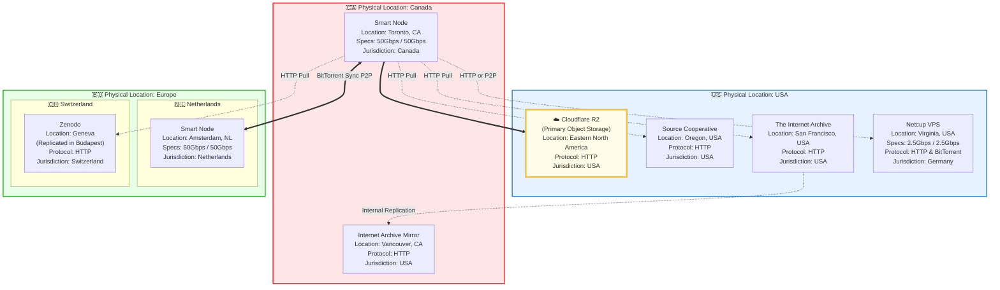

```mermaid
flowchart TD
    %% ---------------------------------------------------------
    %% STYLING
    %% ---------------------------------------------------------
    style Canada_Region fill:#ffe6e6,stroke:#ff0000,stroke-width:2px
    style USA_Region fill:#e6f2ff,stroke:#0066cc,stroke-width:2px
    style Europe_Region fill:#e6ffe6,stroke:#009900,stroke-width:2px
    
    %% Highlight Primary Storage
    style R2 fill:#fffde7,stroke:#fbc02d,stroke-width:4px

    %% ---------------------------------------------------------
    %% REGION: CANADA
    %% ---------------------------------------------------------
    subgraph Canada_Region ["🇨🇦 Physical Location: Canada"]
        direction TB
        NodeTO["Smart Node
Location: Toronto, CA
Specs: 50Gbps / 50Gbps
Jurisdiction: Canada"]
        
        IA_Van["Internet Archive Mirror
Location: Vancouver, CA
Protocol: HTTP
Jurisdiction: USA"]
    end

    %% ---------------------------------------------------------
    %% REGION: USA
    %% ---------------------------------------------------------
    subgraph USA_Region ["🇺🇸 Physical Location: USA"]
        direction TB
        SourceCoop["Source Cooperative
Location: Oregon, USA
Protocol: HTTP
Jurisdiction: USA"]
        
        R2["☁️ Cloudflare R2
(Primary Object Storage)
Location: Eastern North America
Protocol: HTTP
Jurisdiction: USA"]
        
        IA_SF["The Internet Archive
Location: San Francisco, USA
Protocol: HTTP
Jurisdiction: USA"]
        
        Netcup["Netcup VPS
Location: Virginia, USA
Specs: 2.5Gbps / 2.5Gbps
Protocol: HTTP & BitTorrent
Jurisdiction: Germany"]
    end

    %% ---------------------------------------------------------
    %% REGION: EUROPE
    %% ---------------------------------------------------------
    subgraph Europe_Region ["🇪🇺 Physical Location: Europe"]
        direction TB
        subgraph Netherlands ["🇳🇱 Netherlands"]
            NodeAMS["Smart Node
Location: Amsterdam, NL
Specs: 50Gbps / 50Gbps
Jurisdiction: Netherlands"]
        end
        
        subgraph Switzerland ["🇨🇭 Switzerland"]
            Zenodo["Zenodo
Location: Geneva
(Replicated in Budapest)
Protocol: HTTP
Jurisdiction: Switzerland"]
        end
    end

    %% ---------------------------------------------------------
    %% CONNECTIONS
    %% ---------------------------------------------------------
    
    NodeTO <==>|BitTorrent Sync P2P| NodeAMS
    IA_SF -.->|Internal Replication| IA_Van
    
    NodeTO -.->|HTTP Pull| SourceCoop
    NodeTO ==> R2
    NodeTO -.->|HTTP Pull| Zenodo
    NodeTO -.->|HTTP Pull| IA_SF
    NodeTO -.->|HTTP or P2P| Netcup
```
